# 04. SYSTEM ARCHITECTURE & COMPONENT TOPOLOGY
## Decoupled Pipeline, Microservice Contracts, and Data Flow
**Status:** `VERIFIED — CURRENT IMPLEMENTATION`  

---

### 1. Architectural Philosophy: Decoupled Dual-Stage Design

A foundational discovery in the HelixZero project is that naked sequence activity and chemically modified potency operate under divergent biophysical rules:
- Evaluating naked sequences on chemically modified datasets yields near-random accuracy ($r = 0.1771, R^2 = -0.0901$).
- Conversely, optimizing chemical modifications directly on a full transcript requires searching an astronomical space ($\sim 30^{42}$ configurations).

HelixZero resolves this by decoupling the system into two distinct, coordinated tiers:
1. **Tier 1 (Transcript Scanning & Naked Selection):** Fast CPU-bound scanning of the target mRNA to identify structurally accessible, non-toxic naked 21-mer scaffolds with favorable thermodynamic asymmetry ($\Delta\Delta G^\circ_{37}$).
2. **Tier 2 (Chemical Modification Potency Optimization):** Takes curated lead scaffolds and explores synthetic chemical configurations using a 517-D multi-modal CatBoost engine, biophysical guardrails, and 2-bit transcriptome safety verification.

---

### 2. End-to-End System Architecture

```mermaid
flowchart TD
    subgraph Tier1["Tier 1: Upstream Transcript Screening"]
        FASTA[Target mRNA FASTA / GenBank] --> Parser[parser.py: Sequence Ingestion]
        Parser --> Gen[sirna_generator.py: Sliding 21-mer Generator]
        Gen --> FeatA[features.py: 214-D Asymmetry & Reynolds Rules]
        FeatA --> ModelA[Model A: LightGBM GBDT Booster]
        ModelA --> CalibA[calibrator.py: Isotonic Calibration]
        CalibA --> Domain[Domain Detection: 5' UTR, CDS, 3' UTR]
        Domain --> LeadSel[predictor.py: Curated Lead Selector]
    end

    subgraph Tier2["Tier 2: Chemical Modification Engine"]
        LeadSel --> ModGen[modification_engine.py / multislot_designer.py]
        ModGen --> Schema[chem_schema.py: NucSlot Orthogonal Mapping]
        Schema --> FeatB[features_v4.py: 517-D Multi-Modal Vectorizer]
        FeatB --> CatBoost[model_b_v4.py: Unified Dose CatBoost Regressor]
        CatBoost --> Hill[predictor.py: Analytical Hill Inversion pIC50]
    end

    subgraph Tier3["Tier 3: Biophysical Guardrails & Safety Firewall"]
        Hill --> Guardrails[biophysics.py: 4-Domain Penalty Engine]
        Guardrails --> Firewall[offtarget.py: 2-Bit Packed Transcriptome Index]
        Firewall --> Pareto[Pareto Multi-Objective Ranking]
    end

    subgraph Tier4["Tier 4: Structural Modeling & Delivery"]
        Pareto --> PDB[pdb_generator.py: Continuous A-Form PDB 504 Atoms]
        PDB --> API[api/main.py: FastAPI REST Microservice]
        API --> UI[app.html: Single-Page Laboratory Workbench]
    end
```

---

### 3. Detailed Component Descriptions

#### 3.1 Upstream Sequence Parser & Generator (`parser.py`, `sirna_generator.py`)
- Reads raw nucleotide input from direct string input or FASTA upload.
- Normalizes sequence: uppercase conversion, strips whitespace, replaces `T` with `U`.
- Generates overlapping 21-mers along the transcript. For each guide sequence, constructs the complementary passenger strand with canonical $3'\text{-dTdT}$ overhangs.

#### 3.2 Lead Selector & Transcript Domain Partitioning (`predictor.py:select_curated_leads`)
- Detects the canonical Open Reading Frame (longest `AUG` to Stop codon with $\ge 50$ amino acids).
- Accurately partitions candidates into **5' UTR**, **CDS**, and **3' UTR**.
- Applies three hard biological filters:
  1. *Functional Integrity:* Rejects palindromes and severe self-complementary hairpins.
  2. *Seed Viability:* Rejects lethal cytotoxins matching Janas high-toxicity hexamers ($< 50\%$ viability).
  3. *Spatial Diversity:* Enforces $\ge 35$ nt separation between selected leads to prevent positional clustering.

#### 3.3 517-D Multi-Modal Feature Extractor (`features_v4.py`)
- Aggregates features from 4 independent sub-systems:
  - 444 chemical descriptors: 420 positional slot flags (10 flags per position $\times$ 42 slots) + 24 global descriptors.
  - 64 RNA-FM evolutionary embeddings: PCA-32 for sense + PCA-32 for antisense.
  - 5 ViennaRNA thermodynamic features: MFE sense, MFE antisense, duplex $\Delta G$, ensemble diversity, GC ratio.
  - 4 exposure covariates: $\log_{10}(\text{Dose\_nM})$, relative dose $[\log_{10}(C) - 1.0]$, normalized duration, hepatic lineage.

#### 3.4 Unified Dose-Aware CatBoost Regressor (`model_b_v4.py`)
- Predicts biological knockdown $[0.0, 100.0]\%$ directly from the 517-D input vector.
- Analytically derives compound potency via closed-form Hill inversion:
  $$\text{IC}_{50} = C \cdot \left(\frac{100 - y}{y}\right)^{1/h}, \quad p\text{IC}_{50} = 9 - \log_{10}(\text{IC}_{50} \, [\text{nM}]).$$

#### 3.5 Deterministic Biophysical Guardrail Engine (`biophysics.py`)
- Adjusts raw machine learning scores across 4 biophysical domains:
  1. *Helicase Unwinding:* Penalizes excessive binding affinity ($\Delta\Delta G < -35\text{ kcal/mol}$).
  2. *Serum Exonuclease:* Penalizes lack of terminal phosphorothioate protection (evaluated against Alnylam AT3 benchmark).
  3. *TLR7/8 Immunogenicity:* Penalizes unmasked pathogenetic hexamers (`UGGC`, `GUUC`, `UGU`, etc.).
  4. *Seed Cytotoxicity:* Cross-checks positions 2–7 against the empirical Janas 4,096-hexamer viability table.

#### 3.6 2-Bit Whole-Transcriptome Off-Target Safety Engine (`offtarget.py`)
- Pre-indexes the human RefSeq transcriptome ($94\text{M}$ 15-mers) into 30-bit integers (2 bits per nucleotide).
- Executes $O(1)$ set membership queries to detect multi-gene slicing cross-reactivity ($> 6$ off-target hits triggers a $-40.0$ point safety penalty).

#### 3.7 Continuous A-Form 3D PDB Structural Generator (`pdb_generator.py`)
- Generates 504-atom PDB models based on ideal A-form geometry ($2.81\text{ \AA}$ rise, $32.7^\circ$ twist).
- Encodes chemical modifications directly into the crystallographic B-factor column ($90.0=2'\text{-F}, 80.0=2'\text{-OMe}, 70.0=\text{PS}$, etc.) for interactive 3Dmol.js rendering.
