# 05. DATA ARCHITECTURE & STORAGE PIPELINE
## End-to-End Data Lifecycle, Formats, and Feature Store
**Status:** `VERIFIED — CURRENT IMPLEMENTATION`  

---

### 1. Data Lifecycle Pipeline

The HelixZero data architecture governs the flow of experimental biological measurements from public databases to binary feature stores and training matrices:

```mermaid
flowchart LR
    Source["Raw Public Repositories (CMsiRNAdb, Novartis, Davis)"] --> Ingest["Data Ingestion & Multi-Slot String Parsing"]
    Ingest --> Clean["Cleaning & Outlier Filtering (42,638 Clean Records)"]
    Clean --> Group["Sequence Clustering (5,251 Antisense Groups)"]
    Group --> FeatGen["Multi-Modal Feature Vectorization (517-D)"]
    FeatGen --> Store["Binary Feature Store (cmsirnadb_clean_features_X_517.npy)"]
    Store --> Split["Zero-Leakage GroupKFold Partitioning (5 Folds)"]
    Split --> Train["CatBoost GBDT Model Training & Checkpoint Export"]
```



---

### 2. Storage Formats and Persistent Artifacts

The system employs optimized serialization formats to ensure sub-millisecond inference and fast model retraining:

| File / Artifact | Location | Format | Size | Purpose |
| :--- | :--- | :--- | ---: | :--- |
| `cmsirnadb_clean_features_X_517.npy` | `smepred/data/processed/` | NumPy Binary (`.npy`) | 36.7 MB | Complete pre-computed 517-D feature matrix for $N = 17,761$ training rows. |
| `cmsirnadb_clean_targets_Y.npy` | `smepred/data/processed/` | NumPy Binary (`.npy`) | 71.2 KB | Target biological knockdown percentages $[0.0, 100.0]\%$. |
| `cmsirnadb_clean_meta.csv` | `smepred/data/processed/` | CSV Table | 2.50 MB | Metadata table with `target_gene`, concentration, assay duration, and cell line. |
| `human_transcriptome.idx.pkl` | `smepred/data/` | Packed Pickle (`.idx.pkl`) | 863.8 MB | Pre-computed 2-bit packed transcriptome hash index ($94\text{M}$ 15-mers, 6-mer/7-mer tables). |
| `vienna_features_cache.pkl` | `smepred/models/` | Pickle Dictionary | 3.67 MB | Persistent disk cache storing calculated thermodynamic parameters per duplex pair. |
| `rnafm_embeddings.pkl` | `smepred/models/` | Pickle Dictionary | 56.5 MB | Pre-computed 640-D RNA-FM foundation embeddings dictionary for training sequences. |
| `rnafm_pca_32.pkl` | `smepred/models/` | Joblib Pickle | 85.8 KB | Fitted PCA model projecting 640-D RNA-FM embeddings into 32 orthogonal dimensions. |
| `modification_codes.json` | `smepred/data/` | Structured JSON | 2.44 KB | Standardized nomenclature and biochemical definitions for 30 chemical modifications. |

---

### 3. In-Memory Data Representations

1. **`NucSlot` Object (`smepred/src/chem_schema.py`):**
   ```python
   @dataclass
   class NucSlot:
       base: str          # Canonical base: 'A', 'C', 'G', 'U', 'T'
       sugar: str         # Ribose chemistry: '2OMe', '2F', '2MOE', 'LNA', 'deoxyribo', 'ribo'
       linkage_3p: str    # 3' Internucleotide linkage: 'PO' (canonical) or 'PS' (phosphorothioate)
       base_mod: str      # Covalent base modification (e.g. '5mC', 'pseudoU')
       terminal_5p: str   # 5' Terminus status: '5P', '5VP', 'none'
       conjugate: str     # Targeting conjugate: 'GalNAc', 'Cholesterol', 'none'
   ```
2. **517-D NumPy Vector (`np.ndarray` float32):**
   Directly fed to CatBoost inference wrappers without intermediate pandas conversions, ensuring $< 0.1$ ms vector transformation per candidate.

---

### 4. Zero-Leakage Grouping and Split Architecture

To eliminate the sequence leakage crisis in tiling screens:
- **Grouping Attribute:** Core 19-nt antisense guide sequence (`anti_seq`).
- **Splitting Mechanism:** `sklearn.model_selection.GroupKFold(n_splits=5)`.
- **Validation Isolation:** All concentration titrations (e.g. 0.01 nM, 0.1 nM, 1.0 nM, 10 nM, 100 nM) and chemical variants sharing an antisense sequence core are strictly confined to a single fold. Overlap between training and validation sequence clusters is guaranteed to be strictly $0.0\%$.
