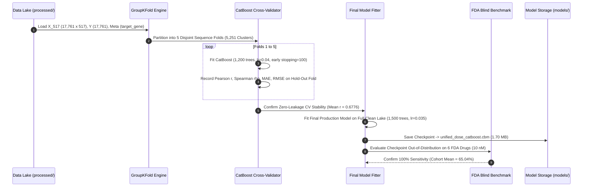

# 12. TRAINING PIPELINE & CROSS-VALIDATION HARNESS
## Zero-Leakage Sequence Grouping, Iteration Schedules, and Model Export
**Status:** `VERIFIED — CURRENT IMPLEMENTATION`  
**Primary Training Script:** `scripts/train_unified_dose_aware_catboost.py`  

---

### 1. Training Pipeline Execution Flow

The training pipeline for the flagship Unified Dose-Aware CatBoost Regressor is structured into five sequential stages:



---

### 2. Step-by-Step Training Implementation

#### Step 1: Data Lake Ingestion
- Loads `cmsirnadb_clean_features_X_517.npy` ($17,761 \times 517$ float32).
- Loads `cmsirnadb_clean_targets_Y.npy` ($17,761$ float32).
- Ingests `cmsirnadb_clean_meta.csv` and extracts `target_gene` groupings across 5,251 unique clusters.

#### Step 2: 5-Fold Zero-Leakage Cross-Validation
- Initializes `GroupKFold(n_splits=5)`.
- For each fold:
  - Allocates 4 folds ($\sim 14,200$ samples) for training and 1 fold ($\sim 3,560$ samples) for validation.
  - Trains CatBoost with early stopping (100 rounds without validation RMSE improvement):
    ```python
    cb = CatBoostRegressor(
        iterations=1200,
        learning_rate=0.04,
        depth=6,
        l2_leaf_reg=3.0,
        loss_function="RMSE",
        random_seed=42 + fold,
        verbose=False
    )
    cb.fit(X_train, Y_train, eval_set=(X_val, Y_val), early_stopping_rounds=100)
    ```
  - Calculates out-of-fold metrics across all five folds.

#### Step 3: Production Model Fitting
- Once cross-validation metrics are certified, a final production model is fitted across the complete clean dataset:
  ```python
  final_cb = CatBoostRegressor(
      iterations=1500,
      learning_rate=0.035,
      depth=6,
      l2_leaf_reg=3.0,
      loss_function="RMSE",
      random_seed=42,
      verbose=100
  )
  final_cb.fit(X, Y)
  ```
- Wall-clock training duration: $\sim 35\text{--}45$ seconds on an 8-core CPU.

#### Step 4: Model Checkpoint Export
- Serializes the trained production checkpoint to:
  `smepred/models/unified_dose_catboost.cbm`
- File size: **1.70 MB** (1,696,528 bytes).

#### Step 5: Blind FDA Clinical Lead Verification
- Evaluates the exported model against all six commercial FDA-approved drugs at 10.0 nM:
  - Patisiran: 73.70%
  - Givosiran: 66.24%
  - Lumasiran: 61.27%
  - Inclisiran: 76.68%
  - Vutrisiran: 52.27%
  - Nedosiran: 60.10%
- Verifies that all 6 compounds exceed the 50% clinical lead threshold (100% sensitivity).
